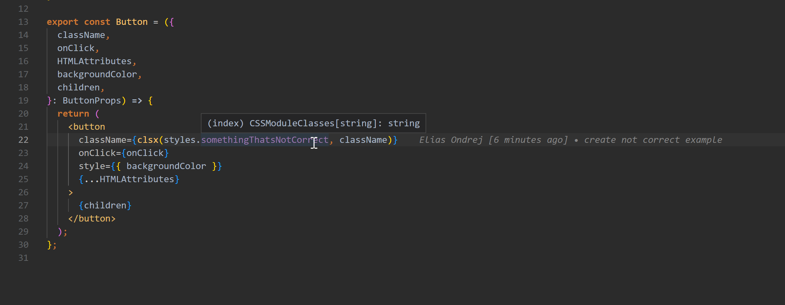

# Example repo for issue 195
The problem with typescript-plugin-css-modules and VSCode not providing type hints. 
Github issue: https://github.com/mrmckeb/typescript-plugin-css-modules/issues/195

The problem is simulated in package `/packages/ui`. There is a typescript component Button in `packages/ui/src/components/atoms/button/Button.tsx`

